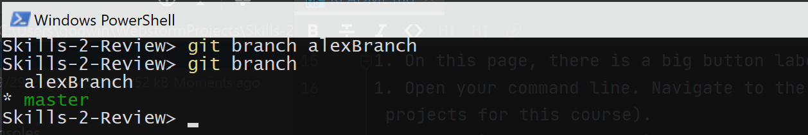
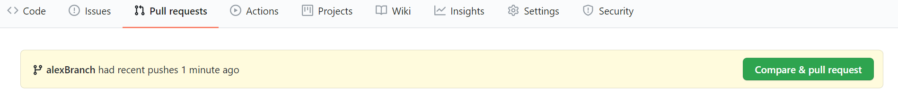
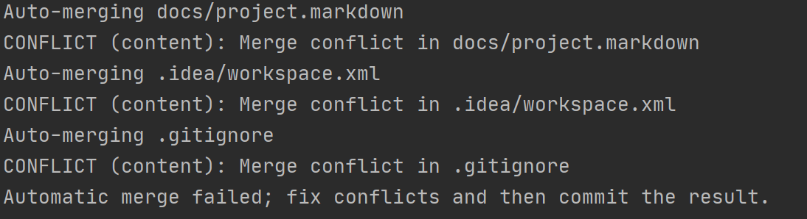
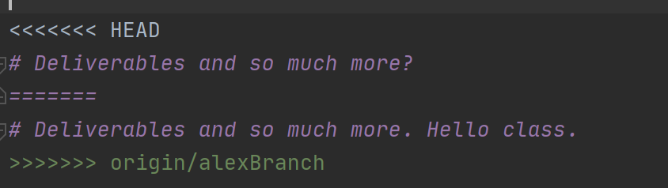
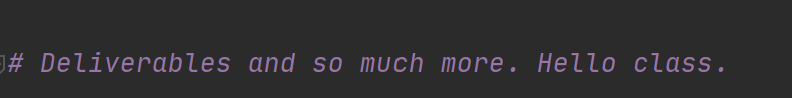

# Skill-Building Assignment 2

## Code Review and Collaborative Development. 

One of the most important things you will need to get comfortable with in collaborative software development is the use of branching and merging to work on software in parallel with a teammate. 

Since you have accepted this assignment in GitHub classroom, you now have a custom directory created and associated with your account. Successful completion of this skill building assignment requires that you gain familiarity with issues and the project board associated with this repository.

**Note:** This assignment assumes that you have some basic familiarity with using GitHub for solo projects, but may have limited experience in working in groups. If you have no experience with GitHub, then you will need to visit an [overview site](https://guides.github.com/introduction/git-handbook/) to refresh or develop your skills. For this assignment, you will only need the git commands: clone, status, add, commit, branch, checkout, merge, and push. 

> **DO NOT** use the command `force` in any context on GitHub, ever.

You may also find it much easier on this assignment, and many assignments, to work with an IDE that is specifically designed for web programming. I am a fan of [Webstorm by JetBrains](https://www.jetbrains.com/webstorm/). Though it is another application to learn, it can greatly simplify software engineering tasks, including working with a team on GitHub. 

## Step 1 - Clone your Repo locally

Because you can see these instructions, that means that you have already followed the link and accepted the assignment. GitHub classroom has automatically created a repository for you on GitHub and imported the starting code into it. A full tutorial for how to do this with GitHub is available [here](https://riptutorial.com/github/example/23708/clone-a-repository), but the basic steps are the following:

1. On this page, there is a big button labeled **Code**. If you click it, you get the web URL for this online repo.
1. Open your command line interface (CLI). Navigate to the directory that you want to clone your repo (somewhere on your computer that you keep your projects for this course). If you are using WebStorm it will have likely created a folder called `WebstormProjects` somewhere on your machine that would work quite nicely for this.
1. Type: git clone *copied_url_from_step_1* and hit enter.
1. Open the directory in Sublime so that you can see the code for this assignment.

## Step 2 - Create a branch 
You are currently in the master branch. That is where the "final code" for your software products will go. But, everyone cannot be working on the master branch at the same time - it would cause too many headaches and conflicts. 

In your local project repo, create a new branch by typing `git branch` *yournameBranch*. If I were doing this assignment, I would call it `alexBranch`. After you have done this, go ahead and type `git branch` with no arguments behind it. It should look like the following:

## Step 3 - Get to work on your code

Let's start working in this branch. In the same terminal, type `git checkout` *yournameBranch*. Nothing much will change from your perspective, but you are now on the newly created branch. Type `git branch` again, and when the branches are listed, you'll notice that the asterisk has moved from the master to your branch. 

In this repo, in the /docs folder, is the source code for the course website. It is written primarily in markdown (the same format that this readme is written in), and is designed to be rendered using Jekyll (learning Jekyll is not required for this assignment). It is ideal for static sites that do not need any server- side code running, though it does include some limited functionality that can make a site feel more dynamic (like news posts for a blog). 

With your partner, you should choose a file you are both going to work on. Any of the markdown files are fair game, but you must decide together. 

In your local repo, while still in the branch you created, modify the first of the files. Your partner will do the same. You should both edit the same numbered line in the markdown file. It does not have to be a large edit, and it should be on the lines outside the Jekyll header at the top of each of the markdown files. When you are done, add, commit, and push the changes to the online repo. You may get an error message indicating that an online branch needs to be created, but git will give you exactly what you need to type to correct this message. For me, for example, it is `git push --set-upstream origin alexBranch`.

## Step 4 - Someone goes first as Reviewer

Pick one of your team members to volunteer for review first. While you should both work together to complete all the steps here, the person who goes first will have a slightly easier responsibility for what they must directly do in the repository, so it might be beneficial to let the person who is less familiar with GitHub be the reviewer first. 

The other person (not the first reviewer) will go to GitHub and, under the pull requests tab, will click the big green button to `Compare & Pull Request`. Under the Reviewers to the right, assign your teammate to review the pull request. 

Whoever is assigned as first reviewer will now compare the changes that have been made. As this is the first merge from a branch to the master branch, there should be no conflicts. GitHub will most likely tell you that the branches can be merged automatically and that the pull request can then be closed. The first reviewer should type in a few comments on the changes, then merge the branch and close the pull request. 

## Step 5 - Resolving Conflicts.

Conflicts occur when changes have been committed to a branch at a specific line, and someone attempts to merge into that branch but has not yet pulled the changes from that line into the branch. 

1. Person A branches
2. Person B branches
3. Person A & B both change line 10 of a file in their own branches.
4. Person A merges their branch into master. 
5. Person B's branch is now behind the master by one commit. When the person goes to merge the changes from their branch, they will be notified that there is a conflict that must be resolved first.  

Now the tricky part - resolving that conflict. By merging the changes from the first pull request, the changes from that branch are now in the master. However, the changes from the first reviewer's branch are not in the master, and the changes in the master are not in the first reviewer's branch.

There are a few ways to manage the next steps. It can be accomplished using the command line tools, through a web programming IDE (e.g., WebStorm), GitHub desktop (a standalone program that can help manage repositories), or even through the GitHub interface on the web.

The following steps teach you how to do this on the command line. Using other tools is very similar, but requires that you familiarize yourself with that tools convention. 

We are assuming that the first reviewer is currently still in their branch on their machine and that you have committed all local changes to that branch.

1. Checkout the master branch. `git checkout master` 
2. Pull the newest version of the master branch from GitHub.com `git pull` At this point, your local master branch is now up to date with the changes that your partner made and that you accepted in the last pull request. 
3. Checkout your branch. `git checkout yournameBranch`
4. Merge the changes from the master branch into your branch. `git merge master`
5. You will likely see something like the image below, indicating that the merge could not be completed automatically because one or more files had a conflict. 

When GitHub attempts merges from a branch into another and conflicts are present, it marks the conflicts with text that will keep the code from compiling. Something along the following: 

Notice the two lines  from `<<<<<<< HEAD` to `>>>>>>>>origin/alexBranch`. There are two versions of the line present. The first indicates what is present in the other branch (e.g., the master). The `=========` separates the line(s) present in the origin from what is in the other `alexBranch`. To resolve this using direct editing of the text, you just choose which one you want to keep and save the file, which creates something along the following lines:

Notice the second of the two options was retained, and everything else has been deleted. These changes are ready to be pushed. Once you have cleaned up all the conflicts (there should be only one) commit and push to your repo, then go to GitHub and, under the pull requests tab, will click the big green button to `Compare & Pull Request`. Under the Reviewers to the right, assign your teammate to review the pull request. 

> Something to notice - the conflicts were merged "in the branch". Instead, we could have checked out master and merged the branch into master - managing conflicts "in the master". However, this makes it much easier to introduce errors directly into the master. In a collaborative and well-functioning team, you should rarely commit/push directly to master. Instead, you deal with the problems in the branch, and only when ready, issue pull requests for a member of your team to review.

## Step 6 - Someone goes second as reviewer

Just like your partner did for you, review and approve the changes. Then merge the pull request and close it.

## Last step - Get a Grade

You are now ready to have someone else take a look at your code and submit this for assessment. Create a new issue called "grade my assignment" and assign it to the instructor. We should see two successful pull requests, one reviewed by each of you. Your list of commits should also make it clear that the first pull request was merged automatically, but that conflicts needed to be resolved before the second was merged.
